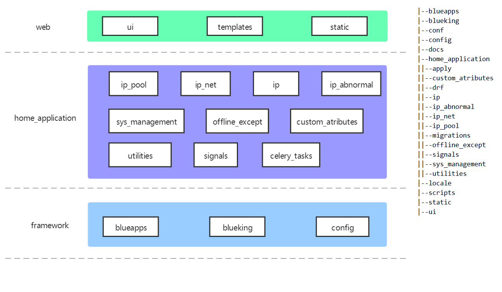

# 代码目录

代码主要可以分为蓝鲸开发框架层 framework、主业务逻辑层 home_application以及前端展示层 web。

- framework

  蓝鲸基于 django 框架的二次封装架构，主要提供 SaaS 运营在蓝鲸 PaaS 上的基础配置和服务。

  config：工程各部署环境配置，如本地环境、测试环境、正式环境，以及路由配置。

  blueapps：新版开发框架核心模块，包括蓝鲸统一登录、鉴权、中间件和公共函数。

  blueking：蓝鲸 API Gateway SDK，包括配置平台、作业平台等提供的API。

- home_application

  IP管理的主体业务逻辑层，包含IP池、IP子网、IP、系统设置及后台任务等功能。

  ip_pool：IP资源池管理。

  ip_net：IP子网管理。
  
  ip_abnormal：异常IP管理。
  
  offline_except：IP白名单管理。
  
  sys_management：系统设置、日志操作、CMDB同步等功能。
  
  custom_attributes： 资源池、子网、IP自定义属性相关管理功能。
  
  utilities：公用方法逻辑，包括数据效验、数据转换等的逻辑。
  
  signals：Django信号，现有post_migrate做创建数据库后的数据初始化。
  
  celery_tasks: celery 后台任务

  models：数据库设计。  

- web

  前端资源，包括 webpack 配置和静态资源。

  ui：所有的前端代码逻辑，使用vue2.0，包括webpack打包的相关配置。

  static：框架内置的前端js、css，以及ui目录打包后的相关文件，会存放到dist文件夹下，。

  templates：包含首页和 django admin 需要的页面。

  locale：国际化翻译文件。
